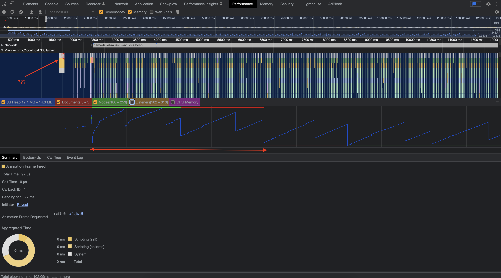
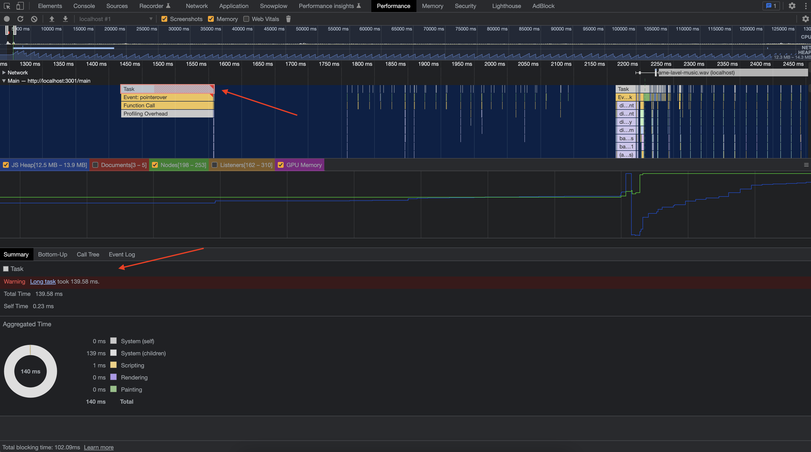
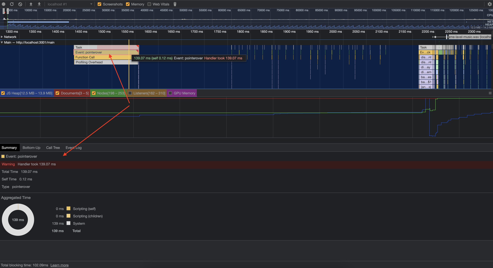
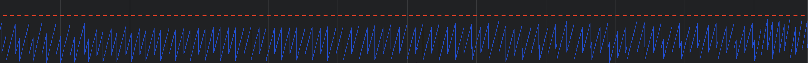
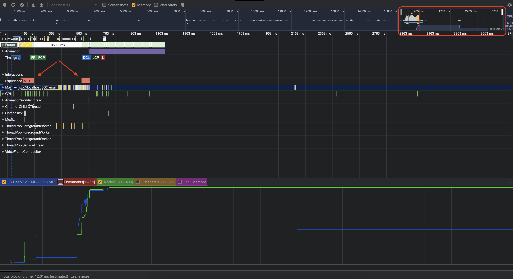

### Что такое утечки памяти?

### Виды утечек памяти

1. Один
2. Два
3. ...

### Вкладка Memory

скрины + описание

### Вкладка Performance

Для выявления утечек памяти была сделана запись игры в течение ~120 секунд, от перехода на стартовый экран, самого процесса игры и до окончания игры, в данном случае — проигрыша.

#### Начало игры

*Скриншот вкладки Performance с результатом записи во время прохождения игры*

В начале записи можно увидеть возрастание значения выделяемой памяти — в этот момент произошел переход на страницу начала игры, количество нод и выделяемой памяти резко возросло, но затем стабилизировалось.

После уменьшения масштаба можно заметить красный треугольник на задачах перед "скачком".

*Состояние JS Heap в начале игры*

Рассмотрим этот момент ближе и раскроем секцию Main.

> В DevTools можно увидеть flame-график активности в основном потоке с течением времени. По оси X представляется время, а каждая полоса — событие, чем она длиннее — тем, соответственно, больше времени задача занимает. По оси Y представляется стек вызовов, если события идут "друг под другом" — значит верхние события вызвали нижние. [2]

Секция Main и панель Summary отображают информацию для выделенной области записи. Красный треугольник на задаче — это предупреждение о возможной проблеме, связанной с этим событием.

*Информация о возможной проблеме с задачей*

При детальном рассмотрении DevTools сообщает, что задача заняла 139.58 ms. Если провалиться дальше по стеку, то видно, что дело в событии pointerover. 

*Информация о событии pointerover*

??и как решать эту проблему https://web.dev/optimize-long-tasks/?utm_source=devtools

#### Во время игры

График JS Heap не показывает постоянного увеличения расходуемой памяти. Скачки памяти происходят с неизменной периодичностью. Можно заметить, как значение используемой памяти увеличивается, затем следует его уменьшение, а затем опять увеличение. После каждой очистки памяти ее размер не становится больше, а значит — утечки памяти нет.

*График JS Heap во время прохождения игры*

#### Конец игры

Для наблюдения за утечками памяти после окончания игры и перехода на лендинг была сделана отдельная запись. На графике можно заметить скачок выделенной памяти — это и есть момент перехода на главную страницу. Но далее видно, что выделенная память освобождается — утечки не происходит.

*Скриншот записи после окончания игры*

На графике также можно заметить Layout Shift, который происходит при переходе на главную. К этому вернемся далее, в части Web Vitals.

#### Приложение

скрины + описание

### Web Vitals (?)

скрины + описание

### Вывод

Утечек (таких и таких) не обнаружено

Скачков памяти нет

Есть лейаут шифт (плохо) из за сср?
Есть долгие таски

По игре / по приложению

### Полезности

https://habr.com/ru/articles/309318/
https://developer.chrome.com/docs/devtools/#performance

