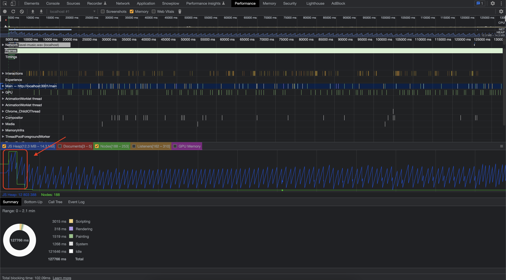

### Что такое утечки памяти?

### Виды утечек памяти

1. Один
2. Два
3. ...

### Вкладка Memory

скрины + описание

### Вкладка Performance

Для выявления утечек памяти во время игры была сделана запись игры в течение ~120 секунд, от перехода на стартовый экран, самого процесса игры и до окончания игры, в данном случае — проигрыша.

#### Начало игры

*Скриншот вкладки Performance с результатом записи во время прохождения игры*

В начале записи можно увидеть возрастание значения выделяемой памяти — в этот момент произошел переход на страницу начала игры, количество нод и выделяемой памяти резко возросло, но затем стабилизировалось.

После уменьшения масштаба можно заметить красный треугольник на задачах перед "скачком".

*Состояние JS Heap в начале игры*

Рассмотрим этот момент ближе и раскроем секцию Main.

> В DevTools можно увидеть flame-график активности в основном потоке с течением времени. По оси X представляется время, а каждая полоса — событие, чем она длиннее — тем, соответственно, больше времени задача занимает. По оси Y представляется стек вызовов, если события идут "друг под другом" — значит верхние события вызвали нижние. [2]

Секция Main и панель Summary отображают информацию для выделенной области записи. Красный треугольник на задаче — это предупреждение о возможной проблеме, связанной с этим событием.

*Информация о возможной проблеме с задачей*

При детальном рассмотрении DevTools сообщает, что задача заняла 139.58 ms. Если провалиться дальше по стеку, то видно, что дело в событии pointerover. 

*Информация о событии pointerover*

??и как решать эту проблему https://web.dev/optimize-long-tasks/?utm_source=devtools

#### Во время игры

График JS Heap не показывает постоянного увеличения расходуемой памяти. Скачки памяти происходят с неизменной периодичностью. Можно заметить, как значение используемой памяти увеличивается, затем следует его уменьшение, а затем опять увеличение. После каждой очистки памяти ее размер не становится больше, а значит — утечки памяти нет.

*График JS Heap во время прохождения игры*

#### Конец игры

Для наблюдения за утечками памяти после окончания игры и перехода на лендинг была сделана отдельная запись. На графике можно заметить скачок выделенной памяти — это и есть момент перехода на главную страницу. Но далее видно, что выделенная память освобождается — утечки не происходит.

*Скриншот записи после окончания игры*

На графике также можно заметить Layout Shift, который происходит при переходе на главную. К этому вернемся далее, в части Web Vitals.

#### Приложение

Для поиска утечек памяти по остальному приложению была сделана запись на ~100 секунд и проделаны основные действия пользователя: просмотр главной, смена темы, просмотр лидерборда и профиля, создание новой темы на форуме и т. п.

При просмотре графика можно сделать вывод, что утечек памяти нет, так как график JS Heap не возрастает с течением времени и выделенная память освобождается.

*Скриншот записи при просмотре приложения*

### Web Vitals

> **Web Vitals** - это инициатива *Google*, цель которой — предоставить единое руководство по сигналам качества, необходимым для обеспечения хорошего взаимодействия с пользователем в Интернете. [3]

Для приложения также важны показатели производительности, так как они влияют на пользовательский опыт. Например, ранее, при записи на вкладке performance можно было увидеть несколько сдвигов лейаута при переходе на главную. 

*Layout Shift при переходе на главную страницу после окончания игры*

### Вывод

Утечек памяти в приложении и в игре в частности не было обнаружено, однако, есть проблемы с показателями производительности.

Очень сильно заметен сдвиг лейаута (показатель Layout Shift) при переходе на главную страницу. 
(Описать с чем это связано и пути решения)

### Полезные ссылки

1. Статья на хабре - [4 вида утечек памяти в JavaScript и как с ними бороться](https://habr.com/ru/articles/309318/)
2. Документация по вкладке Performance - [DevTools: Performance](https://developer.chrome.com/docs/devtools/#performance)
3. [Статья о Web Vitals](https://web.dev/i18n/ru/vitals/#:~:text=Web%20Vitals%20%2D%20%D1%8D%D1%82%D0%BE%20%D0%B8%D0%BD%D0%B8%D1%86%D0%B8%D0%B0%D1%82%D0%B8%D0%B2%D0%B0%20Google,%D0%B8%D0%B7%D0%BC%D0%B5%D1%80%D0%B5%D0%BD%D0%B8%D1%8F%20%D0%BF%D1%80%D0%BE%D0%B8%D0%B7%D0%B2%D0%BE%D0%B4%D0%B8%D1%82%D0%B5%D0%BB%D1%8C%D0%BD%D0%BE%D1%81%D1%82%D0%B8%20%D0%B8%20%D0%B2%D0%B5%D0%B4%D0%B5%D0%BD%D0%B8%D1%8F%20%D0%BE%D1%82%D1%87%D0%B5%D1%82%D0%BD%D0%BE%D1%81%D1%82%D0%B8.)

